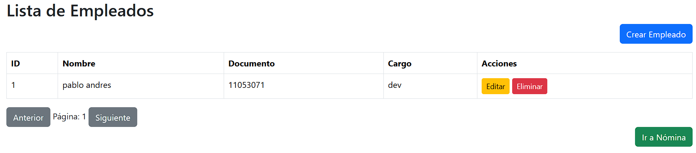
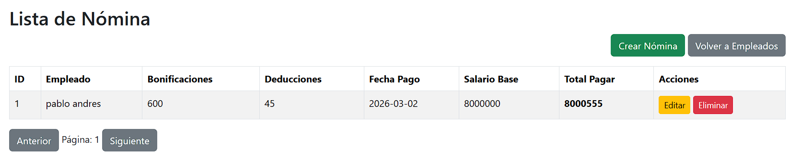

# Sistema de Gestión de Nómina

Sistema web desarrollado con Spring Boot que permite gestionar empleados y administrar su nómina de manera eficiente.

## Funcionalidades

- Registro, edición y eliminación de empleados.
- Gestión de nóminas asociadas a cada empleado.
- Cálculo automático del total a pagar:
  
  Salario Base + Bonificaciones - Deducciones.
- Validaciones para mantener la integridad de los datos.
- API REST con arquitectura backend Java (Spring Boot).
- Interfaz web desarrollada con HTML, Bootstrap y JavaScript.

## Objetivo

Facilitar el control administrativo del personal y automatizar el proceso de cálculo de pagos en una empresa. 

# Configuración del proyecto

## Crear Base de Datos MySQL

CREATE DATABASE nomina_db;

## Verificar que application.properties tenga configurado:

spring.application.name=nomina

spring.datasource.url=jdbc:mysql://localhost:3306/nomina_db

spring.datasource.username=root

spring.datasource.password=

spring.jpa.hibernate.ddl-auto=update

spring.jpa.show-sql=true

spring.jpa.properties.hibernate.format_sql=true

server.port=8080

## Generar archivo .jar

mvn clean package

## Ejecutar el .jar

java -jar target/nomina-0.0.1-SNAPSHOT.jar

## Seguridad

Todas las peticiones requieren el siguiente header obligatorio:

Authorization: Bearer 123456

## 👨‍💻 Autor

Pablo Andres Aroca Garcia
